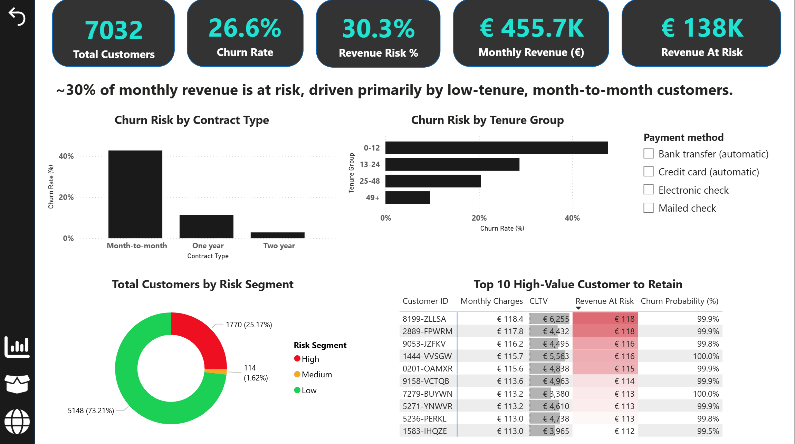
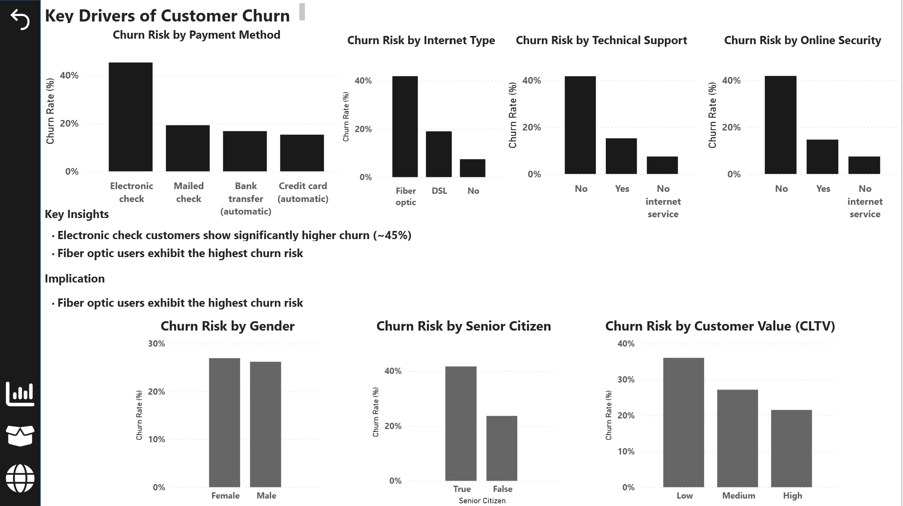
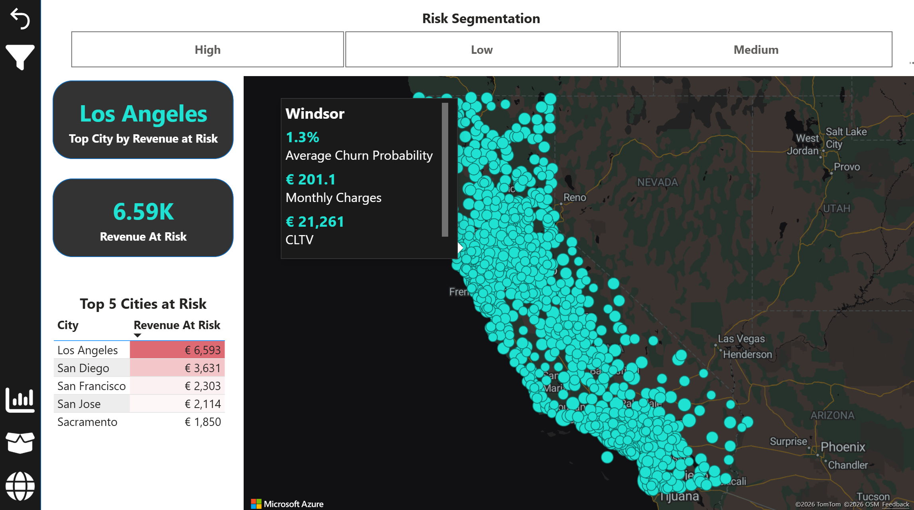
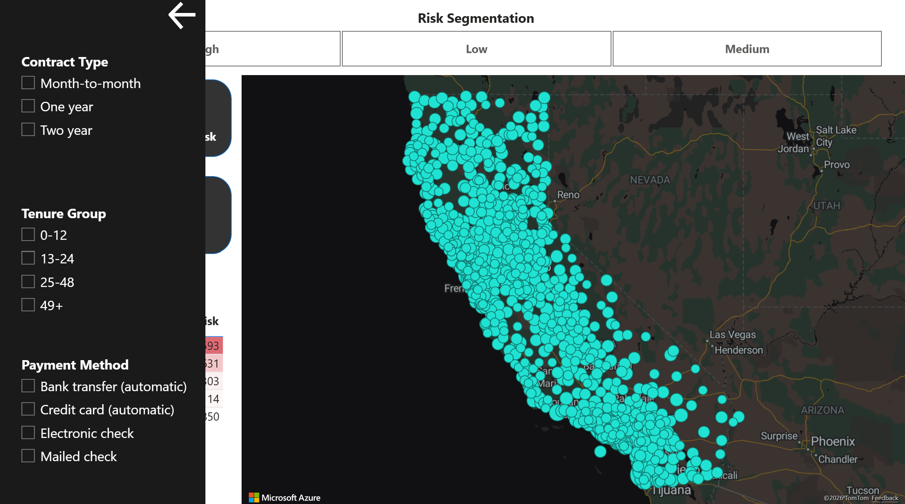

# Customer Churn Prediction & Revenue Impact Dashboard


End-to-end customer churn prediction project combining SQL, Python, machine learning, explainability, API deployment and Power BI dashboards.

The solution helps businesses identify customers at risk of churn, estimate the associated revenue impact, and support targeted retention strategies.

---

## Business Problem

Customer churn is one of the biggest challenges for subscription-based businesses. Losing customers not only reduces recurring revenue but also increases customer acquisition costs.

The objective of this project is to:

* Predict customer churn probability
* Segment customers into risk categories
* Estimate revenue at risk
* Identify the key factors driving churn
* Deliver actionable business insights through dashboards and APIs

---

## Solution Overview

This project follows a complete end-to-end data science workflow:

1. Customer and service data is stored in MySQL
2. Data cleaning and preprocessing are performed in Python
3. Features are engineered for churn prediction
4. An XGBoost model predicts churn probability
5. SHAP explainability identifies the main churn drivers
6. Predictions are stored in SQL and CSV outputs
7. A Power BI dashboard visualizes churn trends and revenue impact
8. A FastAPI service exposes prediction and explainability endpoints

---

## Key Features

* Customer churn prediction using XGBoost
* Revenue at risk estimation
* Risk segmentation (High / Medium / Low)
* SHAP explainability for global and individual predictions
* Rule-based retention recommendation engine
* Hyperparameter tuning with `RandomizedSearchCV`
* Data leakage prevention through careful feature selection
* MySQL integration for structured storage
* FastAPI endpoints for real-time scoring
* Interactive Power BI dashboard
* CSV and SQL export functionality

---

## Dashboard Preview

### Overview

* Churn rate and revenue impact
* High-risk customers and business KPIs



### Churn Drivers

* Main factors associated with churn
* Payment method
* Internet service type
* Technical support and online security
* Customer lifetime value (CLTV)



### Risk Segmentation & Geography

* High-risk regions and cities
* Revenue at risk by geography
* Interactive map visualization





---

## Explainability & Recommendations

The project includes SHAP explainability to make model predictions more transparent and actionable.

### Global Explainability

SHAP beeswarm plots highlight the features with the strongest impact on churn across all customers.

Examples:

* Long customer tenure reduces churn risk
* Month-to-month contracts increase churn probability
* Two-year contracts reduce churn probability
* Electronic check payment methods are associated with higher churn
* High monthly charges can increase churn risk

### Individual Explainability

For a single customer, SHAP waterfall plots show exactly which factors increase or reduce churn risk.

This makes the model more interpretable for business users, customer success teams, and retention specialists.

### Retention Recommendation Engine

The API also generates customer-level retention recommendations based on churn risk, customer profile, and top SHAP drivers.

Example recommendations include:

* Offer a discount for switching to a longer-term contract
* Provide a free technical support trial
* Recommend bundled services to increase stickiness
* Review pricing or loyalty discount opportunities
* Prioritize high-risk customers for retention outreach

This turns the project from a prediction-only solution into a decision-support system for customer retention.

---

## Key Insights

* Approximately 30% of monthly revenue is at risk
* Month-to-month customers show the highest churn rates
* Customers without technical support or online security are significantly more likely to churn
* Fiber optic users exhibit higher churn risk compared to DSL users
* Revenue risk is concentrated in major urban areas such as Los Angeles
* Longer-tenure customers are less likely to churn

---

## Tech Stack

* Python
* Pandas
* Scikit-learn
* XGBoost
* SHAP
* FastAPI
* MySQL
* Power BI
* Jupyter Notebook

---

## Model Tuning & Feature Selection

The churn model uses hyperparameter tuning with `RandomizedSearchCV` to improve predictive performance.

Tuned parameters include:

* Number of estimators
* Maximum tree depth
* Learning rate
* Subsample ratio
* Column sample ratio
* Minimum child weight
* Gamma

Model selection is based on cross-validated ROC-AUC score.

To make the model more realistic and production-ready, leakage-prone variables were excluded from training.

Excluded features include:

* churn_score
* cltv
* Any variables derived from future customer behavior

Only features that would realistically be known before churn occurs are used, such as:

* Contract type
* Payment method
* Monthly charges
* Tenure
* Service usage
* Demographics

This helps ensure that the model generalizes better to real-world business scenarios.

---

## API Endpoints

The project includes a FastAPI application for real-time predictions and explainability.

### Available Endpoints

* `GET /health`
* `POST /predict`
* `GET /predict-by-id/{customer_id}`
* `POST /explain`
* `GET /explain-by-id/{customer_id}`

### Example Prediction Request

```json
{
  "customer_id": "7590-VHVEG",
  "senior_citizen": 0,
  "partner": 1,
  "dependents": 0,
  "tenure_months": 12,
  "monthly_charges": 75.5,
  "total_charges": 906.0,
  "has_internet": 1,
  "num_services": 3,
  "churn_score": 45,
  "cltv": 3200,
  "gender": "Female",
  "city": "Los Angeles",
  "contract_type": "Month-to-month",
  "payment_method": "Electronic check"
}
```

### Example Prediction Response

```json
{
  "customer_id": "7590-VHVEG",
  "churn_probability": 0.7421,
  "risk_segment": "High",
  "estimated_revenue_at_risk": 56.03,
  "model_name": "XGBoost"
}
```

### Example Explainability Response

```json
{
  "customer_id": "7590-VHVEG",
  "churn_probability": 0.7421,
  "top_risk_drivers": [
    {
      "feature": "contract_type = Month-to-month",
      "shap_value": 0.81
    },
    {
      "feature": "payment_method = Electronic check",
      "shap_value": 0.34
    }
  ],
  "top_protective_drivers": [
    {
      "feature": "tenure_months",
      "shap_value": -0.52
    },
    {
      "feature": "contract_type = Two year",
      "shap_value": -0.43
    }
  ]
}
```

---

## Data Pipeline

* Raw customer data is loaded into MySQL
* SQL queries prepare model-ready features
* Python handles cleaning, preprocessing, and feature engineering
* XGBoost predicts churn probability
* Predictions are enriched with business metrics
* Outputs are saved to SQL tables and CSV files
* Power BI visualizes KPIs, churn drivers, and revenue impact
* FastAPI provides a deployment-ready scoring interface

---

## How To Run

### 1. Clone the repository

```bash
git clone https://github.com/tdhorvathds/churn-prediction-dashboard.git
cd churn-prediction-dashboard
```

### 2. Create and activate a virtual environment

```bash
python -m venv .venv
```

Windows:

```bash
.venv\Scripts\activate
```

### 3. Install dependencies

```bash
pip install -r requirements.txt
```

### 4. Set up MySQL database

Run:

* `schema.sql`
* `sql/tables/*.sql`

### 5. Train the model

```bash
python -m src.train
```

### 6. Generate predictions

```bash
python -m src.predict
```

### 7. Generate explainability outputs

```bash
python -m src.explain
```

### 8. Start FastAPI

```bash
uvicorn api.main:app --reload
```

Then open:

```text
http://127.0.0.1:8000/docs
```

### 9. Open the Power BI dashboard

```text
dashboard/churn_dashboard.pbix
```

---

## Business Value

This project demonstrates the ability to deliver an end-to-end machine learning solution that combines data engineering, predictive modeling, explainability, recommendation systems, API development, and business intelligence.

It is particularly relevant for freelance and consulting work involving:

* Customer churn prediction for subscription-based businesses
* Revenue risk estimation and retention analysis
* Predictive analytics for CRM and customer success teams
* Dashboard development for business stakeholders
* Explainable AI solutions using SHAP
* Retention recommendation systems
* FastAPI deployment for real-time scoring
* SQL and Python-based data pipelines
* Machine learning model integration into business workflows

This type of solution can help companies:

* Identify high-risk customers before they leave
* Prioritize retention campaigns more effectively
* Estimate the financial impact of churn
* Improve customer lifetime value
* Support marketing, sales, and customer success teams with actionable insights
* Operationalize machine learning through APIs and dashboards
* Generate personalized retention recommendations for at-risk customers

---

## Future Improvements

* Docker support
* Batch prediction endpoint
* Cloud deployment
* Frontend web application
* Real-time customer success dashboard connected to the API
* Scenario simulation for retention actions
* Monitoring and logging
* Model retraining pipeline
* A/B testing for retention strategies

---

## Author

Built by [Tamas David Horvath](https://github.com/tdhorvathds)

Connect on [LinkedIn](https://www.linkedin.com/in/tdhorvathds/)
